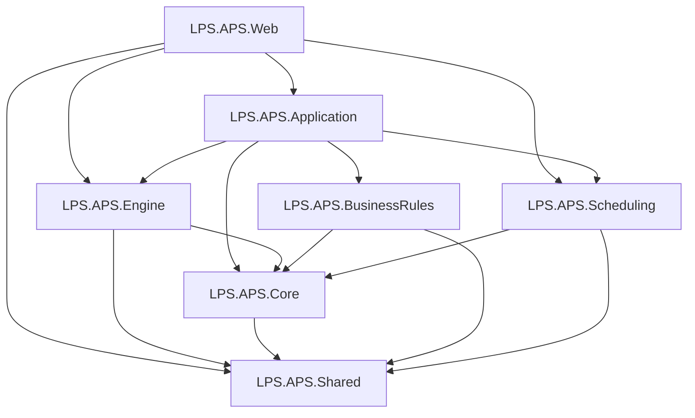

# LPS.APS 高级计划与排程系统

> 基于 .NET 8.0 + DDD + 三库架构的企业级APS系统

## 📁 项目结构

```
LPS.APS/
├── .windsurf/                    # Windsurf 配置目录
│   ├── docs/                     # 设计文档（三层架构、数据流、BOM展开）
│   └── rules.md                  # 统一开发规则
├── LPS.APS.Shared/               # 共享基础设施层
│   ├── Models/                   # 跨层共享模型（TimeWindow、Job、Machine、ScheduleResult等）
│   ├── Configuration/            # 配置选项（Application、API、Business、Redis）
│   └── Extensions/               # DI扩展（AddSharedServices）
├── LPS.APS.Engine/               # 数据引擎层（2号位）
│   ├── Configuration/            # 数据库配置（三库：APS + ODS + Auth）
│   ├── Data/                     # 数据访问（连接管理、批量操作、AuthDbContext）
│   ├── Repositories/
│   │   ├── Base/                 # 基础仓储（IRepository、BaseRepository 重试机制）
│   │   ├── APS/                  # APS本地库仓储（Dapper：Job、Machine、Schedule）
│   │   └── Auth/                 # Auth权限库仓储（EF Core：User、Role、Permission、AuditLog）
│   ├── Services/
│   │   └── Sync/                 # ERP订单同步服务（ODS ext_视图 → Staging → Canonical）
│   ├── Utilities/                # 工具类（ConsoleHelper）
│   └── Extensions/               # DI扩展（AddDatabaseServices + Scrutor自动扫描注册）
├── LPS.APS.BusinessRules/        # 业务规则层（5号位）
│   ├── Rules/                    # (待实现 Pegging、LotSizing、Priority 规则)
│   └── Extensions/               # DI扩展（AddBusinessRuleServices + Scrutor自动扫描）
├── LPS.APS.Core/                 # 核心领域层（领域实体中心）
│   ├── Entities/APS/             # APS库领域实体（Material、Order、Task、BOM、Pegging等16个）
│   ├── Entities/Auth/            # Auth库领域实体（User、Role、Permission等11个）
│   ├── Models/                   # 值对象、DTO
│   └── Services/                 # 域服务
├── LPS.APS.Scheduling/           # 排程算法层（1号位独占）
│   ├── Algorithms/               # 核心算法（IntervalTree时间线段树、TopologicalSort拓扑排序）
│   ├── DataStructures/           # 高性能数据结构（PriorityTaskQueue优先级队列）
│   ├── Solvers/                  # 求解器（FiniteCapacitySolver、TimeSlotFinder、SetupOptimizer）
│   ├── Models/                   # 排程模型（SchedulingContext沙盘、SchedulingTask、SchedulingResult）
│   └── Extensions/               # DI注册（AddSchedulingServices）
├── LPS.APS.Application/          # 应用服务层（3号位）
│   ├── Services/                 # 用例编排
│   └── Extensions/               # DI扩展（AddApplicationServices + Scrutor自动扫描）
└── LPS.APS.Web/                  # Web API层（4号位）
    ├── Controllers/              # API控制器
    ├── Extensions/               # Hangfire配置 + 定时任务注册（UseHangfireJobs）
    └── Program.cs                # 启动配置
```

## 🏗️ 架构设计

### 分层职责

| 层次 | 项目 | 职责 | 红线 |
|------|------|------|------|
| **Web API** | LPS.APS.Web | HTTP接口、中间件、服务注册 | 不写业务逻辑 |
| **应用服务** | LPS.APS.Application | 用例编排、事务协调 | 不写计算逻辑 |
| **核心域** | LPS.APS.Core | 领域实体、值对象、域服务 | 严禁I/O操作 |
| **排程算法** | LPS.APS.Scheduling | 时间槽寻址、换型优化、IntervalTree | **纯内存、零I/O、零数据库依赖** |
| **数据引擎** | LPS.APS.Engine | 数据库访问、仓储、批量操作 | 不写业务规则 |
| **业务规则** | LPS.APS.BusinessRules | Pegging、LotSizing、优先级 | 只写规则插件 |
| **基础设施** | LPS.APS.Shared | 跨层共享模型、配置选项、MemoryCache | 通用抽象 |

### 三库架构（物理隔离）

根据架构文档和RBAC需求，系统采用**三库物理隔离**：

```
┌─────────────────────────────────────────────────────────┐
│  LPS.APS 应用层                                          │
├─────────────────────────────────────────────────────────┤
│  计算标准层 - APS本地库 (APS_Production)                │
│  ├─ 排程计算结果（Task、Pegging）                       │
│  ├─ 主数据（Material、Routing、BOM、Order）             │
│  ├─ 计划版本（PlanVersion + 快照归档）                  │
│  └─ 库存（InventoryFact_ERP/MES + InventoryBalance）   │
├─────────────────────────────────────────────────────────┤
│  集成防腐层 - ODS库 (MES_Integration)                   │
│  ├─ BOM批量展开（存储过程 sp_ExpandBOMBatch）           │
│  ├─ BOM实时展开（紧急插单支持）                          │
│  ├─ 契约视图（ERP_Master_View、MES_Material_View）     │
│  └─ 数据由SQL Server Agent Job驱动，提前做好给APS用     │
├─────────────────────────────────────────────────────────┤
│  权限系统库 - Auth库 (APS_Auth)                          │
│  ├─ RBAC权限（User、Role、Permission）                  │
│  ├─ 数据范围策略（DataScopePolicy）                     │
│  ├─ 审批流（ApprovalFlow、ApprovalNode、ApprovalRecord）│
│  └─ 审计日志（AuditLog）                                 │
└─────────────────────────────────────────────────────────┘
```

**配置示例**（`appsettings.json`）：
```json
"Database": {
  "APS": {
    "ConnectionString": "Server=localhost;Database=APS_Production;...",
    "CommandTimeout": 60
  },
  "ODS": {
    "ConnectionString": "Server=localhost;Database=MES_Integration;...",
    "CommandTimeout": 120
  },
  "Auth": {
    "ConnectionString": "Server=localhost;Database=APS_Auth;...",
    "CommandTimeout": 30
  }
}
```

**使用示例**：
```csharp
// 默认操作APS库（排程计算）
await _connectionManager.QueryAsync<Job>("SELECT * FROM [Order]");

// 操作ODS库（BOM展开请求推送）
await _connectionManager.BulkInsertAsync(bomnoTable, "MES_API_BOM_Request_Detail", DatabaseId.ODS);

// 操作Auth库（EF Core — 注入 IUserRepository / IRoleRepository 等）
var user = await _userRepository.GetByUserNameAsync("admin");
var roles = await _roleRepository.GetRolesByUserAsync(user.Id);
var permissions = await _permissionRepository.GetPermissionsByUserAsync(user.Id);
```

## 📡 依赖关系



**依赖原则**：严格单向依赖，无循环引用。Core作为领域模型中心，Engine/BusinessRules/Scheduling均引用Core以访问实体类型。Scheduling层项目级零数据库包依赖，从编译层面强制保障"纯内存、零I/O"红线。

## 🚀 快速开始

### 环境要求
- .NET 8.0 SDK
- SQL Server 2019+（或兼容版本）
- Redis（可选，用于分布式缓存）

### 编译项目
```bash
# 克隆仓库后
dotnet restore
dotnet build LPS.APS.sln
```

### 配置数据库
1. 修改 `LPS.APS.Web/appsettings.json`
2. 配置三库连接字符串：
   - `Database:APS:ConnectionString` → APS_Production（排程计算）
   - `Database:ODS:ConnectionString` → MES_Integration（BOM展开）
   - `Database:Auth:ConnectionString` → APS_Auth（权限管理）

### 运行项目
```bash
cd LPS.APS.Web
dotnet run
```

### 访问 API
- **Swagger UI**: `http://localhost:5000/swagger`
- **健康检查**: `http://localhost:5000/health`
  - 检查项：`database-aps`、`database-ods`、`database-auth`

## 📋 开发规范

### 架构红线
1. 严守职责边界，严禁跨界修改
2. 严格遵守接口契约
3. 数据库修改由 2号位统一执行
4. 代码提交前必须测试

### 提交规范
```
<type>(<scope>): <subject>

示例：
feat(core): 实现 TimeWindow 值类型结构
fix(api): 修复订单查询接口错误
docs(readme): 更新架构说明文档
```

## 🔧 DI 自动注册（Scrutor）

全部业务层均使用 [Scrutor](https://github.com/khellang/Scrutor) 按命名空间自动扫描注册。  
**同事开发流程**：在对应命名空间下创建 `IXxxService` 接口 + `XxxService` 实现 → 完。无需手动注册。

| 层 | 扩展方法 | 自动扫描命名空间 | 生命周期 |
|---|---------|----------------|----------|
| **Engine** | `AddDatabaseServices` | `Repositories.APS`、`Repositories.Auth`、`Services.Sync` | Scoped |
| **Application** | `AddApplicationServices` | `Application.Services` | Scoped |
| **BusinessRules** | `AddBusinessRuleServices` | `BusinessRules.Rules` | Scoped |
| **Scheduling** | `AddSchedulingServices` | 手动注册（Singleton纯算法） | Singleton |

```
Program.cs 服务注册流水线：
┌────────────────────────────────────────────────────┐
│ AddSharedServices         → 配置选项 + MemoryCache │
│ AddDatabaseServices       → 三库 + Scrutor扫描     │  ← Engine
│ AddSchedulingServices     → 算法求解器(手动)       │  ← Scheduling
│ AddBusinessRuleServices   → Scrutor扫描 Rules      │  ← BusinessRules
│ AddApplicationServices    → Scrutor扫描 Services   │  ← Application
│ AddHangfireServices       → 定时任务框架           │  ← Web
└────────────────────────────────────────────────────┘
```

## 🗄️ 已实现功能

### 基础设施层 (Shared)
- ✅ 跨层共享模型（TimeWindow、Job、Machine、ScheduleResult 等）
- ✅ 配置选项 + 验证器（Application、API、Business、Redis）
- ✅ 内存缓存（Microsoft.Extensions.Caching.Memory）

### 核心领域层 (Core)
- ✅ APS库领域实体（16个：Material、BOM、Order、Task、Pegging、Routing等）
- ✅ Auth库领域实体（11个：User、Role、Permission、ApprovalFlow等）

### 排程算法层 (Scheduling) — 1号位独占
- ✅ IntervalTree 时间线段树（O(log n + k) 时间槽极速检索）
- ✅ TopologicalSort 拓扑排序（产品族域DAG执行顺序）
- ✅ PriorityTaskQueue 优先级任务队列
- ✅ FiniteCapacitySolver 有限产能排程求解器（框架）
- ✅ TimeSlotFinder 时间槽寻址器（倒排/撞墙正排/虚拟库存硬约束）
- ✅ SetupOptimizer 换型优化启发式（SetupAttribute分组）
- ✅ SchedulingContext 排程沙盘模型
- ✅ DI扩展 AddSchedulingServices

### 数据引擎层 (Engine)
- ✅ 三库连接管理（APS + ODS + Auth）
- ✅ APS/ODS 数据访问（Dapper + SqlBulkCopy，性能优先）
- ✅ Auth 库 EF Core 集成（AuthDbContext + 自动审计字段填充）
- ✅ 仓储分层组织（Base/ → APS/ → Auth/）
- ✅ Auth 仓储（User、Role、Permission、AuditLog）
- ✅ APS 仓储（Job、Machine、Schedule）
- ✅ ERP订单同步服务（ODS ext_视图 → Staging → Canonical，含水位线增量同步）
- ✅ 批量数据服务（BulkInsert、BulkUpdate、BulkDelete）
- ✅ 数据库健康检查（APS库、ODS库、Auth库）
- ✅ 重试机制（仅瞬态SQL错误重试，可配置次数和延迟）
- ✅ Scrutor DI 自动扫描注册（新服务零配置）
- ✅ ConsoleHelper工具类（线程安全控制台输出）

### Hangfire 定时任务
- ✅ ERP订单增量同步（每小时整点）
- ✅ ERP订单全量同步（每日凌晨00:30）
- ✅ 定时任务集中管理（UseHangfireJobs 扩展方法）

### 数据库设计文档（DDL已就绪）
- ✅ APS_Production 库 DDL（分区表、防腐层视图、拉链表）
- ✅ MES_Integration ODS 库 DDL（BOM展开请求/结果/归档、实时展开）
- ✅ APS_Auth 库 DDL（13张表：RBAC + 审批 + 审计）
- ✅ 预置角色 7 个、权限 23 个、审批规则模板

### Web API层
- ✅ Swagger文档
- ✅ 健康检查端点
- ✅ CORS配置
- ✅ 响应压缩
- ✅ 异常处理中间件

## 📚 下一步开发

### 阶段一：排程算法实现（1号位）
1. **完善时间槽寻址算法**（Scheduling层）
   - 倒排寻址核心逻辑
   - 撞墙翻转正排
   - 虚拟库存AvailableTime硬约束
2. **局部重排算法**（Scheduling层）
   - 锚点锁定 + 推雪机避让
   - 降级粗排模式
3. **实现BOM遍历**（Engine层）
   - BOM树构建
   - 递归展开逻辑
   - 结果缓存到ODS库

### 阶段二：业务规则实现（5号位）
1. **Pegging规则**
   - 需求-供应匹配
   - 优先级排序
2. **LotSizing规则**
   - 批量计算
   - 合并拆分逻辑
3. **优先级计算**
   - 交期权重
   - 客户优先级

### 阶段三：应用服务编排（3号位）
1. **排程用例**
   - 接收排程请求
   - 调用Engine + BusinessRules
   - 返回排程结果
2. **查询用例**
   - 排程结果查询
   - 甘特图数据转换

### 阶段四：前端开发（4号位）
1. **甘特图展示**
2. **排程参数配置**
3. **结果分析界面**

## 🧪 测试策略

### 单元测试
- Core层：纯函数测试（TimeWindow、IntervalTree）
- Engine层：仓储测试（使用内存数据库）
- BusinessRules层：规则测试（Mock数据）

### 集成测试
- 数据库连接测试
- 双库事务测试
- 健康检查测试

### 性能测试
- BOM展开性能（10万级物料）
- 批量操作性能（SqlBulkCopy）
- 排程计算性能（1000+工单）

## 🤝 协作说明

- **版本控制**：SVN
- **AI辅助**：Windsurf Cascade
- **代码规范**：遵循 `.windsurf/rules.md`
- **分支策略**：主干开发，功能分支合并
- **代码审查**：提交前必须审查

## 📖 参考文档

- `.windsurf/docs/APS_数据架构与防腐层设计方案_v5.0.md` - 三层物理架构、数据管道
- `.windsurf/docs/APS 核心排产全流程走查 (完整版).md` - 30个核心流程、6阶段排程
- `.windsurf/docs/Lean APS  - 研发职责与执行任务包 (2).md` - 各号位职责与红线
- `.windsurf/docs/APS_应用层API接口规范_v2.0.md` - API接口契约
- `.windsurf/docs/APS_数据库表结构设计_v5.0.sql` - APS/ODS库DDL
- `.windsurf/docs/APS_Auth数据库DDL_v1.0.sql` - Auth库DDL
- `.windsurf/docs/Auth库EF_Core使用指南.md` - Auth库EF Core使用示例

---

**架构搭建完成时间**：2026-04-03  
**最近重构时间**：2026-04-08（死代码清理 + Scrutor自动注册 + 仓储分层 + Hangfire集中管理）  
**编译状态**：✅ 7个项目 0 错误 0 警告  
**数据访问**：APS/ODS使用Dapper（性能优先），Auth使用EF Core（关系复杂）  
**DI注册**：Engine/Application/BusinessRules 三层均使用Scrutor自动扫描，新服务零配置  
**下一步**：各号位按分层职责表开始独立开发
